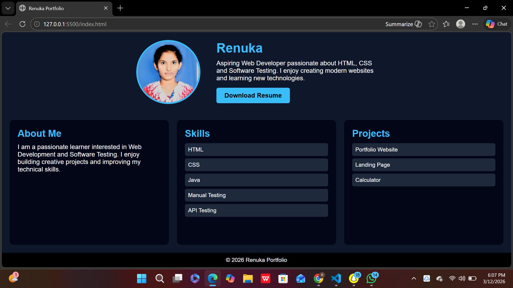

# 🌐 Personal Portfolio Website

## 📌 Internship Information

| Field | Details |
|------|---------|
| **Company Name** | CodSoft |
| **Intern Name** | Garnepudi Renuka Rani |
| **Intern ID** | BY25RY268820 |
| **Domain** | Web Development |
| **Duration** | 4 Weeks |

---

## 📖 Project Title

**Level 1 - Task 1 : Personal Portfolio Website**

---

## 📝 Project Description

This project is a **Personal Portfolio Website** developed as part of the **CodSoft Web Development Internship**.

The portfolio website showcases my personal profile, skills, and projects. It also includes a feature that allows visitors to download my resume.

The main objective of this project is to demonstrate fundamental web development skills using **HTML and CSS** while creating a clean and visually appealing layout.

---

## 🚀 Features

- Profile section with photo
- About Me section
- Skills section
- Projects section
- Resume download button
- Simple and modern UI design

---

## 🛠 Technologies Used

- HTML
- CSS

---

## 📂 Project Structure
Portfolio
│
├── index.html
├── style.css
├── profile.jpg
└── resume.pdf

## 📷 Output Screenshot

